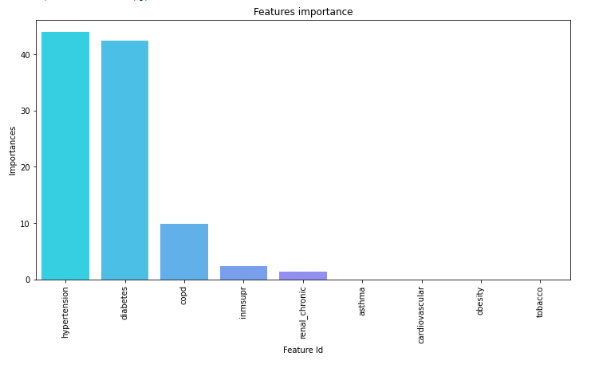
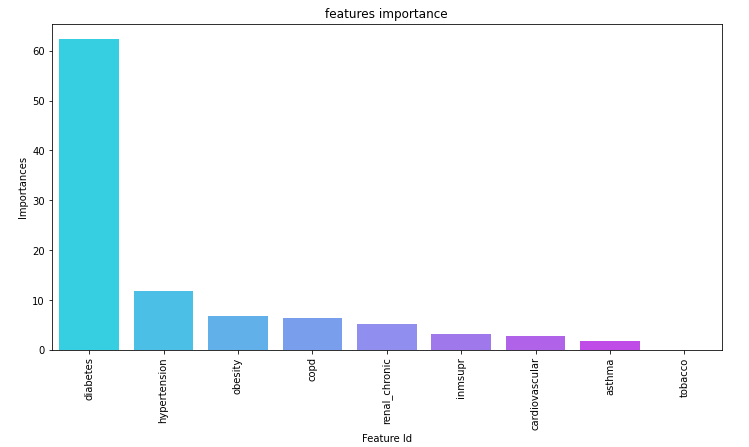
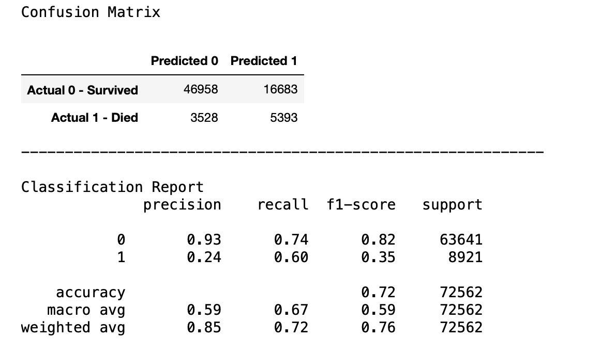
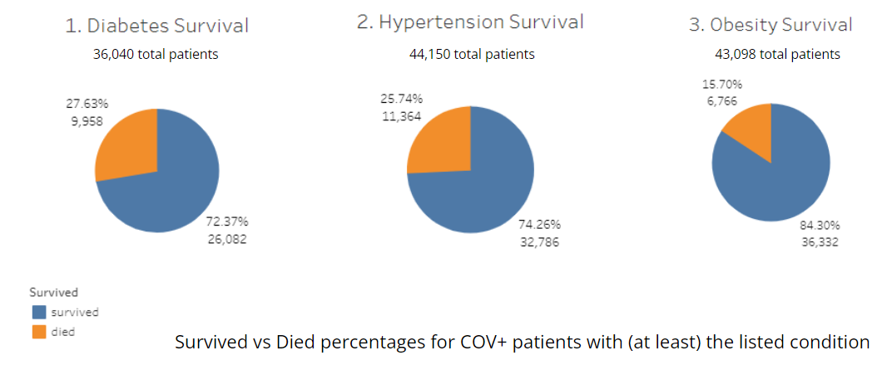
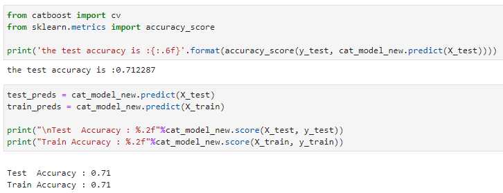
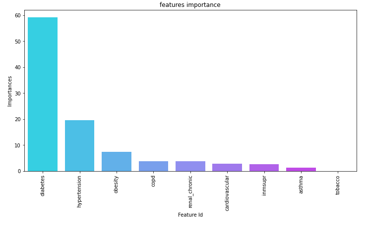
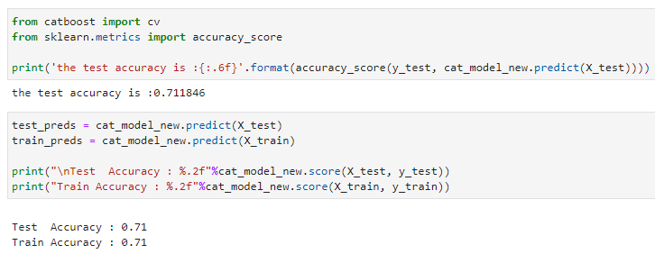
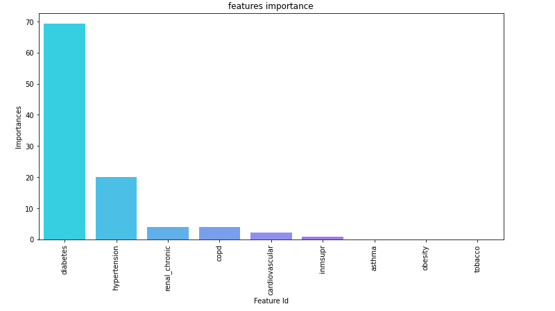

# COVID-19 for the High-Risk

----------
## An analysis of COVID-19 mortality in patients with pre-existing medical conditions.

## Project Description 

This project aims to use a machine learning classification model to predict COVID-19 mortality based on a patient's demographics and pre-existing health conditions.

- This dataset is on the individual patient level and includes a patient's basic demographics, binary values for having common underlying health conditions, COVID-19 result status, ICU and intubation status and date of death (if applicable).
- We have analyzed this dataset through machine learning to predict several patient outcomes(ICU entry, intubation, and death) based on their underlying health conditions.
- Our target variable for mortality prediction is the `date_died` column which provides a date value for patient death or a 9999-99-99 for patient survival and is used to create a new `survived` column of binary values to use in our classification model.
- The `ICU` and `Intubed` columns are similarly set as binary values (1-yes or 2-no) based on whether a patient experienced ICU entry or intubation. These target variables are used individually within the classification model, along with the same features as the mortality analysis to predict a patient's experience. 
- In addition to predicting patient outcome, we also look at feature importance within the machine learning model as a way to see which underlying conditions are most likely to contribute to patient mortality.

**[Click Here](https://docs.google.com/presentation/d/13k2VGWm_J2tI8rKIRiugHNP4i3qLytitx4pIWJaisyA/edit?usp=sharing) for the Google Slides presentation on this topic.**

**[Click Here](https://public.tableau.com/app/profile/alena.swann/viz/COVID-19-Data-Analysis-S4/COVID-19Survival?publish=yes) for the Tableau Dashboard on this topic.**

## Project Team Members

The following are the members contributing to this project:

    - Alena Swann
    - Anshu Malini
    - Michael Williams
    - Sajini Thiagaraj
    - Sheetal Tondwalkar
    - Shreya Srivastava
    

## Tools

    * Creating database
        * PostgreSQL
        * Amazon Web Services(AWS)
        
    * Connecting to database
        * SQLAlchemy
        
    * Analyzing Data
        * Jupyter Notebook
        * Pandas

	* Machine Learning
        * Jupyter Notebook
        * Pandas
		* sklearn
		* matplotlib
		* seaborn
		* catboost
		* imblearn

    * Dashboard and Presentation
        * Tableau Public
        * Google Slides

## Tasks performed to achieve our goal

- Finalize the dataset to be used
- Decide the questions to be answered by the dataset
- Read the data file
- Define the Features and Target Variable
- Split the Data into Training and Testing sets
- Train our Model for different Classification Algorithms namely Decision Tree, SVM Classifier, Random Forest Classifier.
- Select the best Algorithm
        
## Data selection and questions we hope to answer with the data

The deadly disease known as COVID-19, caused by the infectious SARS-CoV-2 virus, has been a pandemic sweeping our world since late 2019 and has been at the forefront of world news, research and crisis management.   The early days of the pandemic had many unknowns, but one trend was beginning to form: COVID-19 symptoms were more severe and mortality was higher in patients with certain underlying health conditions, deeming them 'high-risk'. 

Since then, significant data on COVID-19 patients has been collected and compiled to help better understand the virus and its severity in patients given certain conditions. Machine learning models can be applied to find correlations between COVID-19 mortality and pre-existing health conditions, providing more insight into who is at high risk of a severe case of COVID-19. This insight can be used within hospital resource management and triage prioritization of high-risk patients. 

Mexico's [Open Data General Directorate of Epidemiology](https://www.gob.mx/salud/documentos/datos-abiertos-152127 "Open Data General Directorate of Epidemiology") COVID-19 database was selected for this predictive study as it provides clear, patient-level, categorical data that is ideal for machine learning. Given the large (and daily growing) size of this database, we use a subset of the data (1/1/2020-5/31/2020) that has been partially cleaned and obtained from [Kaggle](https://www.kaggle.com/tanmoyx/covid19-patient-precondition-dataset).

## Database

The dataset will be loaded into a AWS RDS database instance by building a connection to PostgreSQL AWS server  and then connected to Jupyter Notebook for machine learning model manipulation. The initial master data table schema is as follows:

#### Column Descriptions
    -    ID    Case identifier number.
    -    SEX    Identifies the sex of the patient.
    -    PATIENT_TYPE Identifies the type of care received by the patient in the unit. It is called an outpatient if you returned home or it is called an inpatient if you were admitted to hospital.
    -    ENTRY_DATE    Identifies the date of the patient's admission to the care unit.
    -    DATE_SYMPTOMS    Identifies the date on which the patient's symptoms began.
    -    DATE_DIED    Identifies the date the patient died.
    -    INTUBED    Identifies if the patient required intubation.
    -    PNEUMONIA    Identifies if the patient was diagnosed with pneumonia.
    -    AGE    Identifies the age of the patient.
    -    PREGNANCY    Identifies if the patient is pregnant.
    -    DIABETES    Identifies if the patient has a diagnosis of diabetes.
    -    COPD    Identifies if the patient has a diagnosis of COPD.
    -    ASTHMA    Identifies if the patient has a diagnosis of asthma.
    -    INMSUPR    Identifies if the patient has immunosuppression.
    -    HYPERTENSION    Identifies if the patient has a diagnosis of hypertension.
    -    OTHER_DISEASE    Identifies if the patient has a diagnosis of other diseases.
    -    CARDIOVASCULAR    Identifies if the patient has a diagnosis of cardiovascular disease.
    -    OBESITY    Identifies if the patient is diagnosed with obesity.
    -    RENAL_CHRONIC    Identifies if the patient has a diagnosis of chronic kidney failure.
    -    TOBACCO    Identifies if the patient has a smoking habit.
    -    CONTACT_OTHER_COVID    Identifies if the patient had contact with any other case diagnosed with SARS CoV-2
    -    COVID_RES    Identifies the result of the analysis of the sample reported by the laboratory of the National Network of Epidemiological Surveillance Laboratories.
    -    ICU    Identifies if the patient required to enter an Intensive Care Unit.

## Exploratory Data Analysis

1. The raw data in csv form was loaded into Pandas for exploration
2. Most of the data values in the dataset were binary values which made this dataset a classic candidate for implementing binary classification model
3. The date columns like date_symptoms and entry_date do not have any impact on the model and hence was decided to be dropped from the final set 
4. The date_died column would be converted into categorical variables as this is the decided target variable for the model
5. There were certain records with patient Ids having 0 that need to be removed
6. There were records in the dataset who had their covid results as pending. These would not be required for the analysis

Based on the above exploratory steps, the following pre-processing steps were implemented in Python to get the final clean dataset that would be fed into the machine learning model.

### Data Preprocessing

1. We have used Python pandas to load the raw data  into the database and then load it into a dataframe for data cleansing so that we can analyze and make better predictions.
2. Consolidated the data from various sources by removing duplicate patient id's to maintain accuracy and to avoid misleading statistics.
3. We have excluded the covid patients records from our analysis whose results were pending.
4. Formatted the date columns (entry_date, date_symptoms, date_died) into a standard mm-dd-yyyy date format.
5. Converted the date_died column into categorical data by populating it into a new `survived` column for better predictions during the Machine Learning phase.

### Data Loading

We have chosen Postgres on Amazon Web Services (AWS) as our database. We are using SQLAlchemy to connect the database within our Python code which is a Python SQL toolkit to facilitate the communication between pandas and the database.

Our database is named `covid19_data_analysis` that stores the static data in four different tables for our use during the course of the project:

        * covid_dataset
        * clean_covid_dataset
        * column_description
        * catalogs

Below is the entity relation diagrams, showing the relationship among the 2 out 4 tables and their columns:

## Machine Learning Model

- Machine Learning models for binary classification is best used when the output data needs to be classified into two categories. For this dataset, predicting whether the covid patient will die or survive would be our classification.
- To make the best prediction for our dataset, we tried two different classification algorithms for our problem - CatBoost and Balanced Random Forest. 
- Since the dataset is already labeled with the pre-existing health conditions, supervised learning will be used.

### Target Variables

- The main target variable is “survived” as the model aims at predicting if there is a probability of death of a patient based on the reported underlying conditions or not.
- For additional experimentation and learning, target variables like intubed and ICU will also be predicted using the same model.

### Feature Selection and Why?

- In the first pass, the model was run with the following features after dropping age column as the intent of this model was not to study the effect of age on covid deaths: patient_type, sex, intubed, pneumonia, pregnancy, diabetes, copd, asthma, inmsupr, hypertension, other_disease, cardiovascular, obesity, renal_chronic, tobacco, contact_other_covid, icu
- The initial output of the feature importance of the ML model revealed that there is a strong positive correlation between the target variable and the features - patient_type, intubed and icu. Since the above correlations were obvious, these columns were dropped from the feature list. Refer the figure below for the initial feature importance output.

 
- As pneumonia was not an underlying health condition but was a result of the covid disease, this was also dropped from the feature list
- Our model was not built with an intent to study the relationship of gender to covid deaths and hence sex was dropped from the feature list
- Pregnancy made up a very small fraction of the total death count (0.06%) but due to some internal correlation, it was skewing the feature importance results and hence was dropped from the feature list
- Contact other covid was not an underlying condition and hence was excluded from the feature list
- The other disease column was not a clear indication of an exact underlying condition and was dropped from the feature list
- The final feature list consisted of only the variables associated with underlying medical conditions like: diabetes, copd, asthma, inmsupr, hypertension, cardiovascular, obesity, renal_chronic, tobacco
- The dataset fed into the ML model was filtered to have only the records of patients who were covid positive
- The following pie chart shows the percentage of deaths for each underlying pre-existing condition for the covid positive patient dataset. This also aided us in finalizing the feature list:

**THE FOLLOWING MODELS WERE TRIED FOR DEATH PREDICTION AND FEATURE IMPORTANCE**

### Balanced Random Forest Classifier Model

- The accuracy of this model was 67% and hence we needed to try out other models

**Why Random Forest failed?**
- Fewer number of trees was used. We can increase the accuracy of the RF algorithm by increasing the number of trees. This will increase the accuracy but model run-time becomes very slow.
- High correlation among features can lead to low random forest model accuracy. While the algorithm itself provides low correlations through feature randomness, the features we have selected could have been highly correlated.
- Bias can be introduced when one variable is more important than all other variables. If Random Forest model excludes this important feature in each node in one tree, the average of these trees will still result in a bias.
- Random Forest algorithm cannot extrapolate based on the data. This means the predicted values are never outside the training set values for the target variable. Meaning, Random Forest is unable to discover trends that would enable it in extrapolating values that fall outside the training set. When faced with such a scenario, the algorithm assumes that the prediction will fall close to the maximum value in the training set.

- However the feature importance gave a good results as shown below

- Due to low accuracy, the CatBoost classifier was tried out

### Cat Boost Classifier Model with 10 iterations

- The CatBoost Classifier was tried out first with 10 iterations and the training visual  was as follows:

- The accuracy of the model was as follows:

- The feature importance was as follows:

- Since all features were not represented on the feature importance graph, the depth of the trees did not seem to be enough and hence CatBoost was tried with 1000 iterations

### Cat Boost Classifier Model with 1000 iterations

- The CatBoost Classifier was then tried out with 1000 iterations and the training visual  was as follows:

- The accuracy of the model was as follows:

- The feature importance was as follows:

- The confusion matrix and classification report is as follows:

	- Recall is important for this model as false negative prediction of death is not desirable
	- After multiple iterations, the recall achieved for predicting patient death was close to 60%
	- The next steps here will be to work on further optimizing the model to improve recall

- The above model gave a good accuracy of 88% and the feature importance graph had a good representation of all features
- Since finding the top underlying conditions contributing to the patient mortality was the main goal of this model, the accuracy metric was good enough for this experiment. Hence CatBoost with 1000 iterations was selected as the final model.

### Train vs Test Split Size

- Experimentation was done to first split the test and train data into 10% and 90% respectively
- The best result was obtained between a test and train spit of 33% and 67% respectively and that was retained in all models
- The dataset was stratified to get best result

### Benefits of CatBoost Classifier

**CatBoost was studied using available online resources. The following are the benefits of using CatBoost:**

- CatBoost ensures highly accurate model building with great GPU or CPU training speed
- It works well with categorical variables without the need to preprocess them (methods like one-hot encoding is not required to convert variables)
- Catboost requires minimal data preparation
- It provides rich inherent visualizations like feature importance, training process visualization which helps in understanding the model output 
- It is simple to use with Python package
- The gradient boosting method generates decision trees one after another, where the result of one tree is used to improve the next one which helps in improving overall model accuracy
- CatBoost is fast even after increasing the tree depth because it generates symmetric trees

**Advantage of Catboost over other gradient boosting on decision trees (GBDT) algorithms:**

- Catboost prediction time is 13-16 times faster than XGBoost and LightGBM according to its creator Yandex researchers and engineers
- Catboost default parameters offers a better starting point than other gradient boost algorithms which is especially useful for Machine Learning beginners

### Model Features Comparison to Dataset 

When examining these top three features (diabetes, hypertension, and obesity) in our dataset, we can really see the importance of these conditions through their total patient counts and survival percentages. 

These three conditions were the most pervasive in our COVID-19 positive patient dataset, with diabetes reporting 36,040 patients, hypertension with 44,150 patients, and obesity with 43,098 patients. For reference, the next most pervasive condition was tobacco use with rough 17,045 patients reported, followed by asthma with only about 6,045 patients.
Next, after accounting for these larger and relatively similar sample sizes, it appears that the higher the death percentage roughly translates to the greater feature importance in the model. As these 3 conditions have similar sample sizes, diabetes ranks as the top condition with its slightly higher death percentage.

Some other conditions do have higher death percentages, but they are limited by smaller sample sizes, and so are considered less important in the model prediction. For example, COPD has a death percentage of 34.43% but only 3,857 patients in the dataset reported having COPD, and so it is ranked as only fourth in feature importance for the prediction model.

## Additional Analysis - Predicting ICU Entry and Intubation

In further exploration, we wanted to look at which conditions were most important in contributing to a severe case of COVID-19, but not specifically death. 

We used the same CatBoost Classifier model and adjusted our target variable from 'survived' to 'icu' so as to predict a patient's likelihood of being admitted to an Intensive Care Unit (ICU).  

**Running 100 iterations for this ICU prediction**: 

- The model had an accuracy of 71%:

- The model's feature importance was as follows:

We also adjusted the model's target variable to 'intubed' to predict if a patient is likely to be intubated.

**Running 100 iterations for intubation prediction**:

- Model had an accuracy of 71%:

- The model's feature importance was as follows:

It is interesting to see that the top two most influential conditions, diabetes and hypertension, are the same across all three prediction models (with obesity the 3rd most important feature for both survival and ICU entry), reinforcing that patients with these particular conditions are at a greater risk of a severe COVID-19 case. 

## GIT Folder Structure

Refer to the following link for Git Hub structure description.

**[Github Structure Details](https://github.com/amalini10j/Covid19-Data-Analysis/blob/main/References/Project%20Materials/GitHub%20Structure%20for%20Covid%20Analysis.docx)**

    
